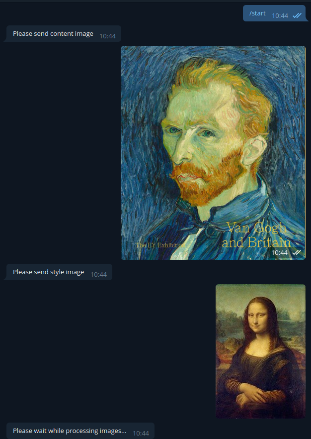
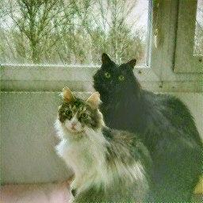

# StyleTransferBot

### @tproject11_bot

Transfer style telegram bot. Hosting on local machine and most of the time shutted down due to the lack of GPU.
All incomming requests are queued.

For hosting on your own just assign your token string to TOKEN in main.py and run as python application 

To transfer style: send content image, then style image and bot will send back result after a while

### Request example:

### Examples results:

